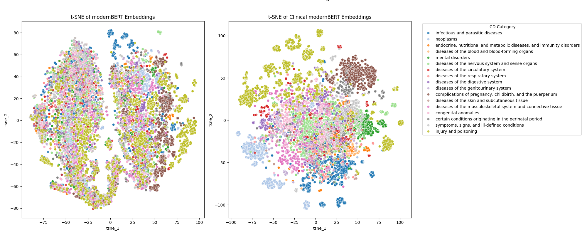

# Clinical ModernBERT: A Long Context Encoder for Biomedical Text

[](https://huggingface.co/Simonlee711/Clinical_ModernBERT)

This repository contains the official implementation and [pre-trained weights](https://huggingface.co/Simonlee711/Clinical_ModernBERT) for **Clinical ModernBERT**, a transformer-based encoder optimized for biomedical and clinical natural language processing (NLP) tasks. Our model leverages state-of-the-art innovations from [ModernBERT](https://arxiv.org/abs/2412.13663), adapted specifically to biomedical literature and clinical data.

---

## Overview

Clinical ModernBERT builds upon ModernBERT's enhancements, including:

- **Extended Context Length (8,192 tokens):** Accommodates lengthy clinical documents such as discharge summaries and comprehensive patient narratives.
- **Rotary Positional Embeddings (RoPE):** Facilitates efficient modeling of long-range dependencies critical for clinical text understanding.
- **Flash Attention:** Significantly reduces computational overhead, enabling efficient processing of extensive biomedical corpora.
- **GeGLU Activation:** Enhances representational capability with improved gradient flow.

The model is pretrained on approximately 40 million PubMed abstracts and real-world clinical notes from MIMIC-IV, combined with structured medical terminologies (e.g., ICD codes). We pre-trained it for 150,000 steps on a single NVIDIA 80GB A100 GPU using a batch size of 128.

## Environment Setup

Create the required environment with Conda:

```bash
conda env create -f environment.yml
```

## Usage

Pretrained model weights and tokenizer artifacts are provided to facilitate easy integration with your downstream biomedical NLP tasks:

```python
from transformers import AutoModel, AutoTokenizer

model = AutoModel.from_pretrained('Simonlee711/Clinical_ModernBERT')
tokenizer = AutoTokenizer.from_pretrained('Simonlee711/Clinical_ModernBERT')
```

---

# Pre-Training Details

## Experimental Results

Clinical ModernBERT achieves state-of-the-art results across several biomedical NLP benchmarks:

| Task                        | Metric   | Clinical ModernBERT | BioClinicalBERT | BioBERT |
|-----------------------------|----------|---------------------|-----------------|---------|
| EHR Classification          | AUROC    | **0.9769**          | 0.9678          | 0.9680  |
| PubMed-NCT                  | Accuracy | **0.9209**          | 0.9145          | 0.9179  |
| MedNER                      | F1 Score | 0.766               | 0.710           | **0.794**   |
| PMC-Patients Retrieval      | NDCG@10  | **0.2167**          | 0.1512          | 0.1956  |

## Visualization

Clinical ModernBERT provides clear semantic clustering for ICD codes, outperforming general-domain models significantly in capturing the inherent structure of medical terminologies.




## Reproducing the pre-training

<details>
<summary>Pre-training Datasources</summary>

- **[PubMed Abstracts (up to 2025)](https://ftp.ncbi.nlm.nih.gov/pubmed/baseline/)**  
  Biomedical literature metadata and abstracts from NLM's PubMed baseline. A primary source for pretraining language models on scientific discourse.

- **[MIMIC-IV Note (v2.2)](https://www.physionet.org/content/mimic-iv-note/2.2/)**  
  A de-identified corpus of real-world hospital clinical notes, covering diverse specialties and temporal contexts, suitable for modeling clinical language patterns.

- **[ICD-9/10/11/12 Disease & Procedure Codes](https://www.cms.gov/medicare/coding-billing/icd-10-codes/icd-9-cm-diagnosis-procedure-codes-abbreviated-and-full-code-titles)**  
  Canonical taxonomy for diagnostic and procedural coding across multiple ICD versions, maintained by CMS. These codes offer structured clinical semantics useful for task supervision or embedding learning.

- **[ICD-10-CM Medication Codes](https://www.cdc.gov/nchs/icd/icd-10-cm/files.html)**  
  U.S. Clinical Modification of ICD-10 providing detailed coding for drugs, toxic agents, and pharmacologic categories. Valuable for aligning text spans to standardized medication representations.

</details>


### How to run the pretraining script

To execute the scripts, run:

```bash
CUDA_VISIBLE_DEVICES=1 python3 pre-train.py
```

---

## Citation

If you find Clinical ModernBERT useful in your work, please cite:

**Paper Citation:**
```
pending
```

**Model Card Citation:**
```latex
@misc {simon_lee_2025,
	author       = { {Simon Lee} },
	title        = { Clinical_ModernBERT (Revision 24e72d6) },
	year         = 2025,
	url          = { https://huggingface.co/Simonlee711/Clinical_ModernBERT },
	doi          = { 10.57967/hf/4999 },
	publisher    = { Hugging Face }
}
```

#### Acknowledgments

This work utilized resources provided by the [UCLA Department of Computational Medicine](https://compmed.ucla.edu/).

---

For further inquiries or collaboration, please contact:
- Simon A. Lee: [simonlee711@g.ucla.edu](mailto:simonlee711@g.ucla.edu)
- Jeffrey N. Chiang: [njchiang@g.ucla.edu](mailto:njchiang@g.ucla.edu)
